# 🚀 React + Vite Project Setup

## 📦 Các Package đã cài đặt

```bash
npm install react-router-dom
npm install axios
npx tailwindcss init -p
npm install react-icons
npm install lucide-react
npm install react-toastify
npm install date-fns
npm install react-to-print
npm install ckeditor4-react --legacy-peer-deps
```

---

## 🌐 **Demo Giao Diện Đạt Được**

### 🏠 **Giao diện Trang chủ**

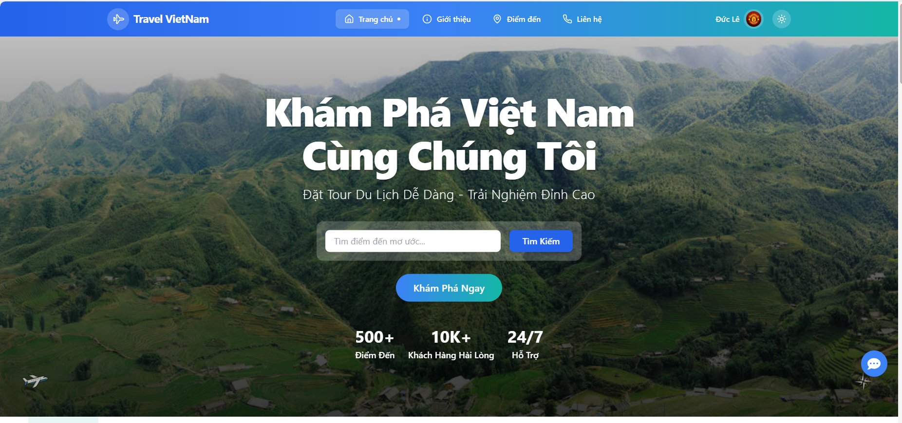

---

### 📖 **Giao diện Trang Giới Thiệu**

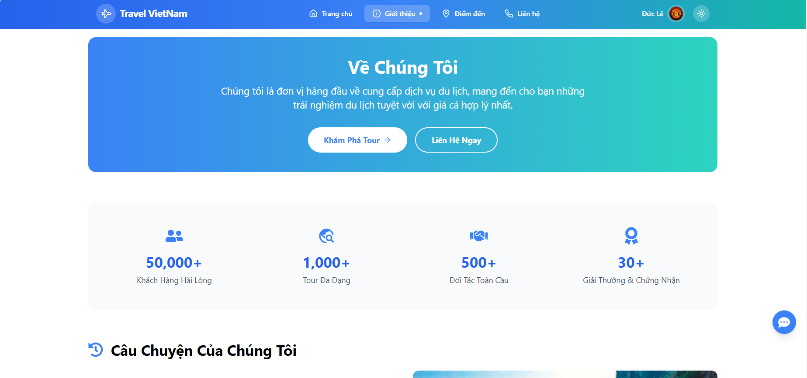

---

### 📞 **Giao diện Trang Liên Hệ**

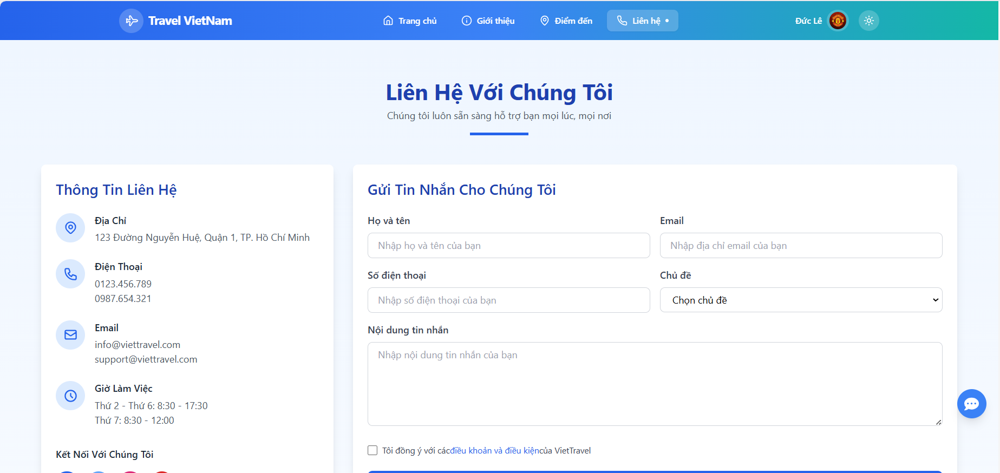

---

### 🧭 **Giao diện Trang Tour**

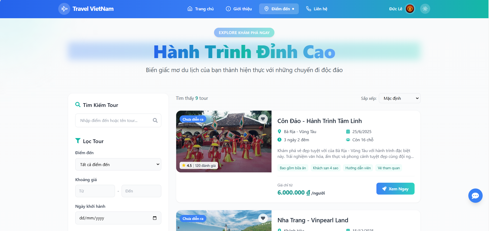

---

### 🗺️ **Giao diện Chi Tiết Tour Du Lịch**

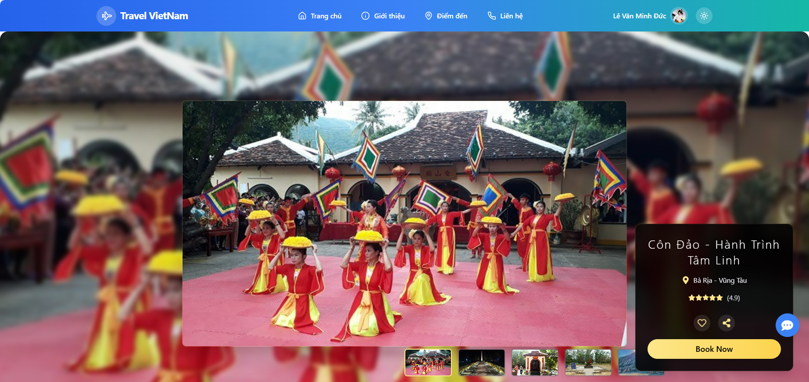  
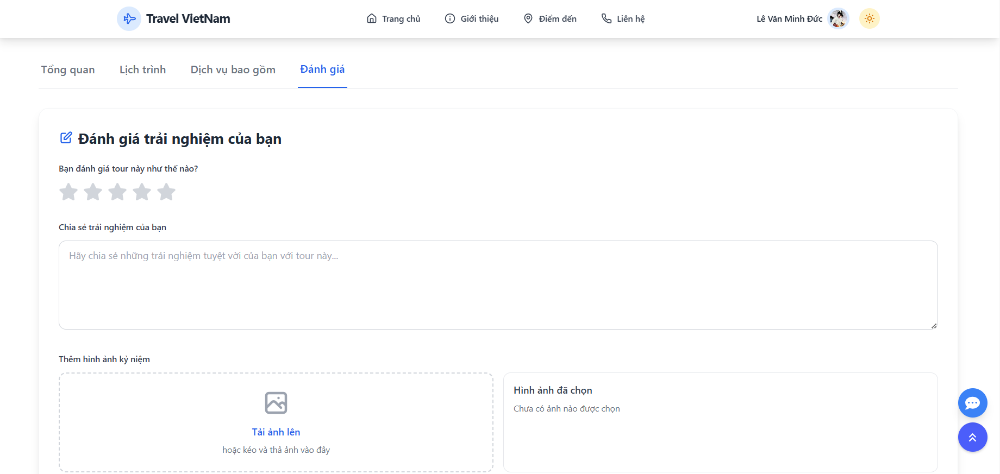

---

### 📋 **Giao diện Đặt Tour**

- **Xác nhận đặt tour**  
  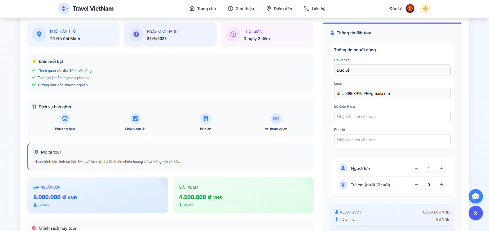

- **Xác nhận thanh toán**  
  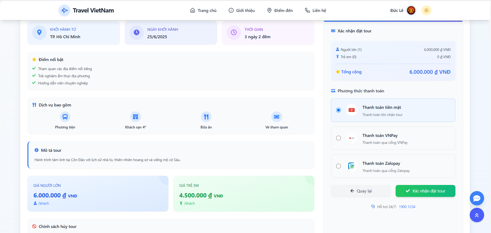

---

### 👤 **Giao diện Quản Lí Thông Tin Cá Nhân**

- **Lịch sử đặt tour**  
  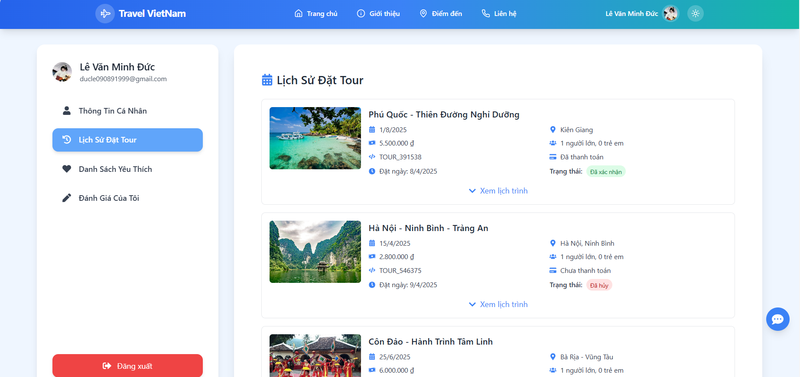

- **Tour yêu thích**  
  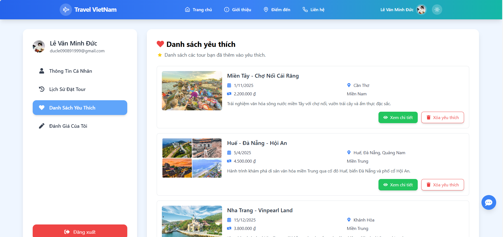

- **Quản lí đánh giá**  
  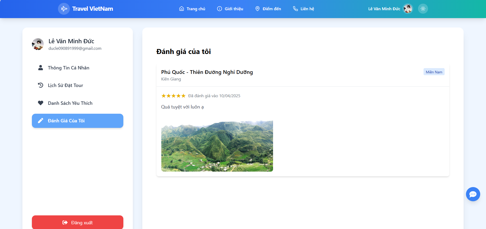

---

### 🤖 **Giao diện Chat với AI**

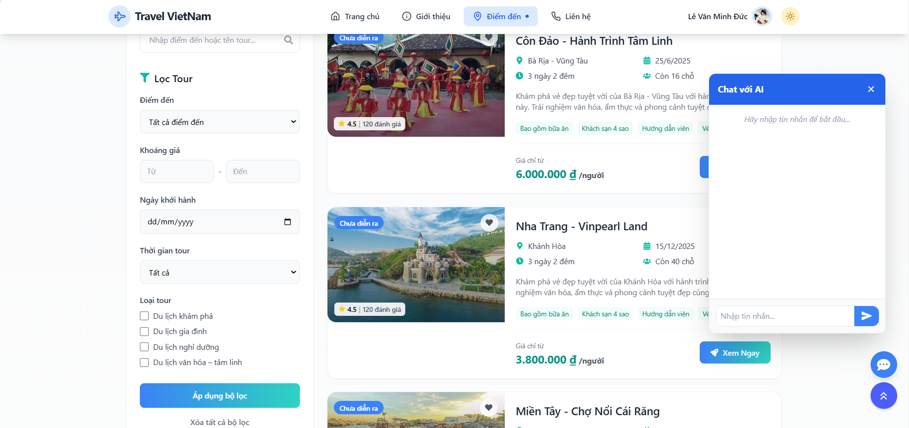
